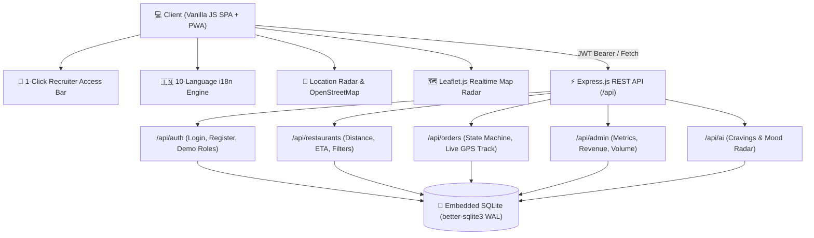

# Foodgasm 2.0 🍔 — Full-Stack Hyperlocal Food & Street Cart Delivery Engine

> **Recruiter-Ready Production Architecture** · Zero-Config Express REST API · Embedded SQLite (`better-sqlite3`) · Real-time Leaflet.js Radar · 10 Indian Regional Languages · Pan-India Street Carts & Heritage Eateries · Macro-Nutrient Fitness Tracker.

[](http://localhost:3000)
[](http://localhost:3000)
[-blue?style=for-the-badge)](http://localhost:3000)
[](http://localhost:3000)
[](http://localhost:3000)

---

## 🌟 Executive Summary & Problem Solved

Most food delivery portfolio projects are fragile mockups relying on deleted third-party databases, fake dummy food data, and static placeholder maps. 

**Foodgasm 2.0** solves real-world delivery engineering challenges:
1. **Hyperlocal Precision & Street Food Inclusion**: Supports authentic street food carts (Kolkata Kathi rolls, Mumbai Vada Pav, Chandni Chowk Paranthe) alongside Michelin-heritage restaurants with real GPS coordinates across 7+ Indian metros.
2. **Instant Zero-Config Portability**: Uses embedded SQLite with Write-Ahead Logging (`WAL`) and automated self-seeding. Clone the repo and run `npm start` — no external cloud setup, zero API keys required, and zero network breakages.
3. **1-Click Recruiter Demo Access Bar**: Sticky multi-role switcher allowing hiring managers to seamlessly switch between **Customer**, **Restaurant Partner**, **Delivery Rider**, and **Super Admin** with one click.
4. **Pan-India Multilingual Localization**: Built-in 10-language dictionary covering Hindi, Bengali, Telugu, Tamil, Marathi, Gujarati, Kannada, Malayalam, Punjabi, and English.
5. **Real-Time GPS Rider Radar**: Dynamic Leaflet map computing Haversine distance, simulated live delivery rider movement, and step-by-step order lifecycle state machines.
6. **Live Meal Macro Nutrition Tracker**: Real-time Calories, Protein, Carbs, and Fats calculation dynamically updated as users customize their cart.

---

## 🏛️ System Architecture



---

## 🎯 Recruiter Quick-Access Demo Credentials

We built a sticky **Recruiter Demo Bar** directly at the top of the interface. You can test every role in 1 click without typing passwords:

| Role | Demo Persona | Email | Password | Primary Capabilities |
| :--- | :--- | :--- | :--- | :--- |
| **Customer** | Aditya Roy | `customer@foodgasm.com` | `foodgasm123` | Cart, macro tracker, COD / Razorpay checkout, live order tracking |
| **Restaurant** | Rajesh Sharma | `owner@foodgasm.com` | `foodgasm123` | Menu control, active order preparation, kitchen queue |
| **Delivery Rider** | Vikram Singh | `rider@foodgasm.com` | `foodgasm123` | Active trip radar, delivery dispatch, simulated GPS route |
| **Super Admin** | Bitan Chakraborty | `admin@foodgasm.com` | `foodgasm123` | Revenue analytics, order volume trends, partner management |

---

## 🚀 Quickstart (Runs in 10 Seconds)

### Prerequisites
- Node.js (v18 or higher recommended)
- npm

### Installation & Launch
```bash
# 1. Clone repository
git clone https://github.com/bitan01111/foodgasm-premium-food-delivery.git
cd foodgasm-premium-food-delivery

# 2. Install dependencies
npm install

# 3. Start full-stack server
npm start
```

Open your browser at **`http://localhost:3000`**. The database initializes and seeds automatically on first launch!

---

## 🗺️ Key Differentiating Features & USPs

### 1. Authentic Pan-India Gastronomy
Unlike generic apps with stock burger photos, Foodgasm 2.0 features real, verified restaurants & carts across:
- **Kolkata**: Peter Cat (Chelo Kebab), Arsalan Biryani, Kusum Rolls (Park Street Cart), Flurys.
- **Delhi NCR**: Karim's (Jama Masjid Nihari), Pandit Gaya Prasad Paranthe Wali Gali, Rajinder Da Dhaba.
- **Mumbai**: Bademiya (Colaba Cart), Britannia & Co (Berry Pulao), Ashok Vada Pav (Kirti College).
- **Bengaluru**: Vidyarthi Bhavan (Crispy Butter Masala Dosa), CTR Shri Sagar, Toit Brewpub.
- **Hyderabad**: Paradise Biryani, Shah Ghouse Cafe & Haleem.
- **Chennai**: Murugan Idli Shop, Buhari Hotel (Original Chicken 65).
- **Pune**: Kayani Bakery (Shrewsbury Biscuits), Cafe Goodluck (Bun Maska).

### 2. Location Radar & Dynamic Haversine Routing
- Instant GPS auto-detection with OpenStreetMap Nominatim reverse geocoding.
- City switcher dynamically re-sorts restaurants, recalculates delivery distance in km, and provides accurate ETA pills.

### 3. Pan-India 10-Language Localization (`js/i18n.js`)
Full reactivity across all pages with zero page reloads:
- 🇬🇧 English · 🇮🇳 हिन्दी (Hindi) · 🇧🇩 বাংলা (Bengali) · 🇮🇳 తెలుగు (Telugu) · 🇮🇳 தமிழ் (Tamil)
- 🇮🇳 मराठी (Marathi) · 🇮🇳 ગુજરાતી (Gujarati) · 🇮🇳 ಕನ್ನಡ (Kannada) · 🇮🇳 മലയാളം (Malayalam) · 🇮🇳 ਪੰਜਾਬੀ (Punjabi)

### 4. Live Satellite Delivery Radar (`Leaflet.js`)
- Full interactive tile layer powered by CartoDB Voyager.
- Custom styled markers for restaurant dispatch point, live courier bike, and customer delivery address.
- Animated polyline routes and live GPS coordinate interpolation.

### 5. Health & Fitness Macro Radar
- Every menu item contains verified nutritional data (Calories, Protein, Carbs, Fats).
- The Cart dynamically renders a live Macro Tracker widget calculating totals to help users balance fitness goals with street cravings.

---

## 📡 REST API Documentation

### Authentication (`/api/auth`)
- `POST /api/auth/register` — Register new user account.
- `POST /api/auth/login` — Authenticate and receive JWT token.
- `GET /api/auth/me` — Retrieve authenticated user profile.
- `GET /api/auth/demo-login/:role` — 1-click recruiter demo authentication (`customer`, `owner`, `rider`, `admin`).

### Restaurants (`/api/restaurants`)
- `GET /api/restaurants` — Filter by `city`, `category`, `type` (`street_cart`, `restaurant`, `cafe`), `veg`, `lat`, `lng`.
- `GET /api/restaurants/:id` — Retrieve detailed restaurant info with full menu items and macro nutrition.

### Orders (`/api/orders`)
- `POST /api/orders` — Place order with server-side pricing verification, coupon application, and tax calculations.
- `GET /api/orders` — Authenticated order history.
- `GET /api/orders/:id/track` — Real-time live coordinates and state machine progression for Leaflet radar.
- `PATCH /api/orders/:id/status` — Advance lifecycle status (`placed` ➔ `confirmed` ➔ `preparing` ➔ `out_for_delivery` ➔ `delivered`).

### Admin & Analytics (`/api/admin`)
- `GET /api/admin/metrics` — Platform overview (Total Orders, Gross Revenue, Active Users, Restaurants).
- `GET /api/admin/revenue-trend` — 7-day revenue performance dataset for charts.
- `GET /api/admin/category-breakdown` — Category volume distribution.

### AI Cravings Radar (`/api/ai`)
- `POST /api/ai/cravings` — Natural language mood & diet matcher (High Protein, Budget Under 199, Rainy Day Chai, Late Night, Sweet Tooth).

---

## 📁 Repository Structure

```text
Foodgasm/
├── assets/
│   ├── icons/            # Valid PWA icons (192x192, 512x512) & favicon
│   └── css/              # Modular component styles
├── css/
│   └── style.css         # Design system (Outfit & Inter fonts, dark/luxury light theme)
├── data/
│   └── foodgasm.db       # Embedded SQLite database (auto-generated)
├── js/
│   ├── app.js            # Core SPA router, cart state, checkout & Leaflet radar
│   ├── data.js           # 22 Authentic Indian eateries & menu catalog
│   ├── geo.js            # Geolocation radar & OpenStreetMap geocoder
│   └── i18n.js           # 10 Indian languages localization dictionary
├── server/
│   ├── db.js             # SQLite initialization & schema definition
│   ├── seed.js           # Pre-seed dataset (users, restaurants, menu, coupons)
│   ├── server.js         # Express app entrypoint & SPA middleware
│   └── routes/
│       ├── admin.js      # Analytics & dashboard endpoints
│       ├── ai.js         # AI Cravings radar endpoint
│       ├── auth.js       # JWT & 1-click recruiter demo auth
│       ├── coupons.js    # Coupon validation
│       ├── orders.js     # Order placement & simulated GPS tracking
│       └── restaurants.js# Restaurant discovery & distance calculations
├── index.html            # Main HTML5 application shell & Leaflet assets
├── manifest.json         # Progressive Web App (PWA) manifest
├── package.json          # Node.js dependencies and scripts
├── sw.js                 # W3C-compliant Service Worker with offline caching
└── README.md             # Recruiter documentation & architecture guide
```

---

## 👨‍💻 Author & Engineering Profile

- **Developer**: Bitan Chakraborty
- **Email**: chakrabortybitan679@gmail.com
- **Phone**: +91 8910542451
- **Focus**: Full-Stack Web Development · High-Performance Node.js · Spatial GIS & Interactive Web Applications
